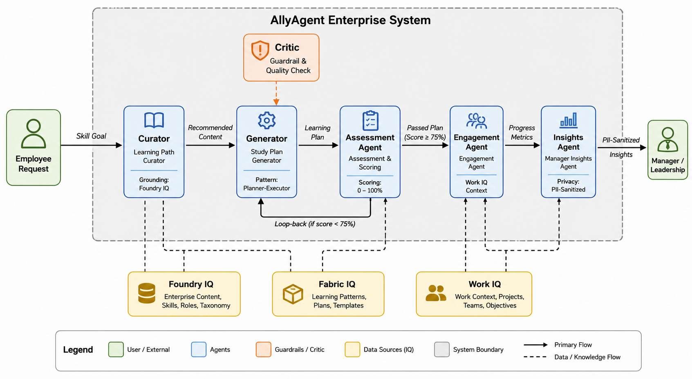

### AllyAgent - Accessibility-Focused Enterprise Copilot
### 🏗️ AllyAgent System Architecture
The following diagram illustrates the multi-agent reasoning topology, highlighting the Planner-Executor patterns, feedback loops, and privacy-preserving data flows within the system:



### Microsoft Foundry Track — Battle #2: Reasoning Agents

AllyAgent is a multi-agent workforce optimization and certification orchestration system. It is designed to help organizations manage internal team certification programs by automatically balancing study requirements against live organizational work signals, keeping learning paths manageable, clear, and highly structured.

---

### ⚠️ MANDATORY DATA COMPLIANCE & PRIVACY STATEMENT
**CRITICAL SUBMISSION NOTE:** This repository contains and processes **SYNTHETIC DATA ONLY**. 
In strict compliance with the Microsoft Foundry Track requirements, all operational inputs, workloads, text documents, and identifiers (e.g., `L-1001`, `EMP-001`) are entirely fabricated, representative, and obviously fictional for validation loops. 
- **NO Real Names Used**
- **NO Real Email Addresses or Communication Records Extracted**
- **NO Real Customer Records, PII, Credentials, or Confidential Azure Information Stored**
All data outputs are processed using deterministic verification wrappers to completely insulate enterprise metrics from privacy exposures.

---

## 🏗️ Core Architecture & Agent Responsibilities

The system coordinates **5 specialized sub-agents** working in an advanced **Planner-Executor** and **Critic-Verifier** topology:

1. **Learning Path Curator (Foundry IQ Grounding):** Maps employee roles directly to certified tracks by parsing structural text from the `Engineering Certification Enablement Guide (Synthetic)`.
2. **Study Plan Generator (Fabric IQ Semantic Layer):** Executes a *Planner-Executor pattern*. It cross-references target curriculum hours with individual calendar signals via custom tools and executes a *Critic phase* to validate and cap milestones at a strict 3-step maximum to limit cognitive load.
3. **Contextual Engagement Agent (Work IQ Context):** Analyzes employee workload velocity. If meeting overhead exceeds 20 hours/week, it automatically triggers a self-correction loop to mute background notifications and isolate alerts to preferred focus slots.
4. **Assessment & Evaluation Agent (Foundry IQ Evaluation):** Reviews simulation score baselines against the mandated 75% passing threshold, intelligently steering the workflow into an iteration loop back if requirements aren't met.
5. **Privacy-Preserving Manager Insights Agent (Fabric + Work IQ):** Computes systemic risk factors across teams due to calendar density while enforcing strict privacy sanitation boundaries to fully eliminate PII leakage.

---

## 📊 Synthetic Datasets Applied
The system reads directly from the challenge-mandated schemas populated in the `/data` directory:
- `learner_performance.json` (Fictional learning historical baselines)
- `work_activity_signals.json` (Contextual meeting/focus metrics)
- `fabric_semantic_seed.json` (Structured certification metadata rules)
- `synthetic_docs.json` (Raw text context and organizational guidelines)

---

## 🚀 Local Installation & Execution

### 1. Initialize Virtual Environment & Dependencies

```bash
# Create and activate environment
python3 -m venv .venv
source .venv/bin/activate

# Install requirements
pip install -r requirements.txt
```

### 2. Execution

Run the orchestration engine to initiate the multi-agent reasoning flow:

```bash
python3 src/orchestrator.py
```

### 🔍 Interpreting the Reasoning Logs

When you run the orchestrator, the system outputs real-time reasoning traces to your terminal. Here's how to navigate the logs:

* **[PLANNER]:** Displays the agent decomposing the user's request into actionable steps.
* **[CRITIC]:** Shows real-time quality checks. If a plan exceeds the 3-step cognitive limit, the Critic rejects the plan and triggers a regeneration event.
* **[PRIVACY]:** Indicates that personally identifiable information (PII) has been scrubbed and sanitized before data reaches the Insights Agent.
* **[SUMMARY]:** Displays the final optimized 3-step learning plan ready for review.
